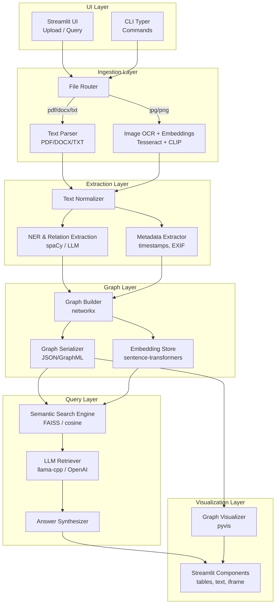

```mermaid
flowchart TD
    subgraph UI Layer
      A1[Streamlit UI <br/> Upload / Query] 
      A2[CLI Typer<br/>Commands]
    end

    subgraph Ingestion Layer
      B1[File Router]
      B2[Text Parser<br/>PDF/DOCX/TXT]
      B3[Image OCR + Embeddings<br/>Tesseract + CLIP]
    end

    subgraph Extraction Layer
      C1[Text Normalizer]
      C2[NER & Relation Extraction<br/>spaCy / LLM]
      C3[Metadata Extractor<br/>timestamps, EXIF]
    end

    subgraph Graph Layer
      D1[Graph Builder<br/>networkx]
      D2[Graph Serializer<br/>JSON/GraphML]
      D3[Embedding Store<br/>sentence‑transformers]
    end

    subgraph Query Layer
      E1[Semantic Search Engine<br/>FAISS / cosine]
      E2[LLM Retriever<br/>llama‑cpp / OpenAI]
      E3[Answer Synthesizer]
    end

    subgraph Visualization Layer
      F1[Graph Visualizer<br/>pyvis]
      F2[Streamlit Components<br/>tables, text, iframe]
    end

    %% UI to Ingestion
    A1 --> B1
    A2 --> B1

    %% Ingestion routing
    B1 -->|pdf/docx/txt| B2
    B1 -->|jpg/png| B3

    %% Ingestion to Extraction
    B2 --> C1
    B3 --> C1

    C1 --> C2
    C1 --> C3

    %% Extraction to Graph
    C2 --> D1
    C3 --> D1

    D1 --> D2
    D1 --> D3

    %% Graph & Embeddings to Query
    D2 --> E1
    D3 --> E1
    E1 --> E2
    E2 --> E3

    %% Query & Graph to Visualization
    E3 --> F2
    D2 --> F1
    F1 --> F2
```